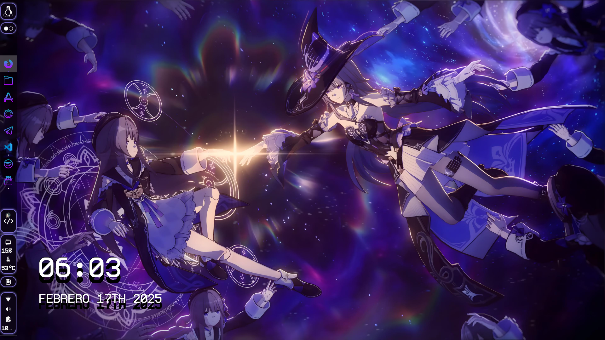
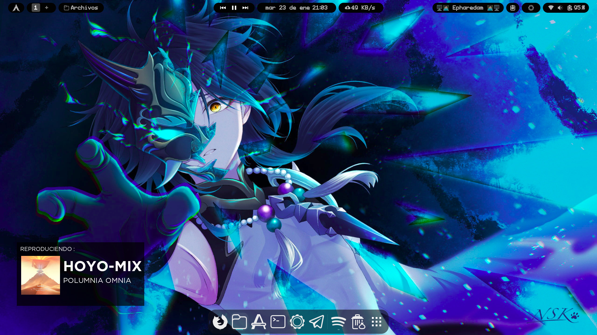

<h1 align="center">Spotify Widget con Reloj</h1>

## Características

- Muestra la información actual de la canción (artista, título) desde Spotify.
- Muestra la carátula del álbum de la canción actual.
- Funciona como un reloj cuando no hay una canción reproduciéndose.

<div align="center" style="display:inline">


</div>

### Tabla de contenido

- [Requisitos](#requisitos)
  - [Paquetes](#paquetes)
  - [Fuentes](#fuentes)
  - [Reproductores](#reproductores)
- [Instalación](#instalación)
- [Recursos](#recursos)

## Requisitos

### Paquetes

-[conky](https://github.com/brndnmtthws/conky/)
-[ffmpeg](https://www.ffmpeg.org/)
-[playerctl](https://github.com/altdesktop/playerctl)

> Ubuntu: `sudo apt install conky ffmpeg playerctl`

> Arch: `sudo pacman -S conky ffmpeg playerctl`

### Fuentes

- [ProFont IIx Nerd Font Mono](https://fonts.google.com/specimen/Montserrat?selection.family=Montserrat:300)
- [Gotham Bold](https://www.fontmirror.com/gotham-bold)
- [ProFont IIx Nerd Font Mono](https://www.fontmirror.com/gotham-book)

En la carpeta abre una terminal y corre el script `./scripts/download-fonts.sh` para descargar las fuentes.

### Reproductores

- [Spotify](https://www.spotify.com/)
- [spotifyd](https://github.com/Spotifyd/spotifyd)
- [VLC](https://www.videolan.org/)
- [Lollypop](https://wiki.gnome.org/Apps/Lollypop)
- [cmus](https://cmus.github.io/)

## Instalación

1. Instale todos los [paquetes] necesarios (#paquetes):

```bash
# Ubuntu
$ sudo apt install conky ffmpeg playerctl
# Arch
$ sudo pacman -S conky ffmpeg playerctl
```

2. Clona el repositorio:

```bash
$ git clone https://github.com/Zerabalus/Spoti-clock
```

3. Asegúrate de que todas las [fuentes](#fonts) necesarias estén instaladas:

```bash
$ ./scripts/download-fonts.sh
```

4. Ejecute el script `start.sh` para iniciar el widget (se va al fondo):

```bash
$ path/to/now-clocking/start.sh
```


## Recursos: 
<p align="center">Créditos a <i><a href="https://github.com/gamehelp16">@gamehelp16</a> , <a href="https://github.com/Rayzr522">@Rayzr522</a> y <a href="https://pastebin.com/wVqEfjf8">d0d090 </a> por usarlos como guías/refs y base</i></p>
